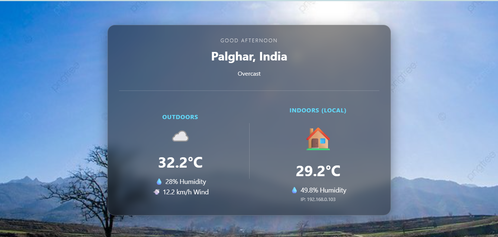

# Weather Station Web Application

A web application that displays real-time weather data using a weather API.

## Features
- Shows real-time outdoor weather data
- Displays temperature, humidity and wind speed
- Indoor sensor monitoring
- Clean weather dashboard UI

## Tech Stack
- React.js
- Node.js
- JavaScript
- Weather API
- HTML / CSS

## Screenshot

## Author
Hiteshi Dhandare
